---
output:
  pdf_document:
    keep_tex: yes
    number_sections: yes
    fig_caption: yes
    toc_depth: 6
  word_document: default
  html_document:
    df_print: paged 
always_allow_html: true 
outp ut:
  pdf_document:
    toc: no
    toc_depth: 6
    fig_caption: yes
    number_sections: yes
header-includes: 
  - \usepackage{pdfpages}
  - \usepackage{tcolorbox}
  - \usepackage{graphicx}
  - \usepackage{setspace}
editor_options: 
  markdown: 
    wrap: 72
---

\includepdf{Page_de_garde}

\newpage

\setstretch{1}

\renewcommand{\contentsname}{\textcolor{blue}{Sommaire}}

\textcolor{blue}{\tableofcontents}

\newpage

```{=tex}
\begin{tcolorbox}[colback=white,colframe=blue, title=Avant-propos ]

Créée en 2008, l’École Nationale de la Statistique et de l’Analyse Économique (ENSAE) est une grande école de statistique à caractère sous-régional située à Dakar (capitale du Sénégal). Elle constitue une direction de l’Agence Nationale de la Statistique et de la Démographie (ANSD), qui est la structure principale du Système Statistique Nationale du Sénégal. 


  Les élèves Ingénieurs Statisticiens Economistes qui suivent une formation de ISE (03 ans) à l'ENSAE  se doivent de suivre le module \textcolor{blue}{Projet statistique sous R } pour apprendre à utiliser et à traiter les données statistiques avec ce logiciel et à synthétiser les données à travers des graphiques afin de faciliter leur comprehension. 
  
  
C’est dans cette optique que s’inscrit ce projet dont le but est de nous plonger au coeur de R Shiny. 
  
\end{tcolorbox}
```
\newpage

```{r setup, include=FALSE}
knitr::opts_chunk$set(echo = TRUE, warning = FALSE, error = FALSE,message = FALSE)
```

\textcolor{blue}{\section*{INTRODUCTION}\addcontentsline{toc}{section}{INTRODUCTION}}

Dans le paysage en constante évolution de l'analyse et de la visualisation de
données, la nécessité de partager des résultats de manière interactive
et convaincante devient de plus en plus cruciale.

Pour cela, le langage R propose le package **Shiny** qui sert à créer
des applications web interactives permettant d’analyser des données,
d'afficher des graphiques, d'exécuter les modèles statistiques de façon
dynamique,... C’est vraiment un outil puissant pour présenter ses
données de façon interactive à des collègues, partenaires, clients et
très simplement en leur partageant juste l’URL de l'application sur le
web. L’application Web peut être intégrée dans un document R Markdown,
une page Web, de manière autonome ou en tant que tableau de bord. La
grande force de Shiny réside dans le fait qu’**il n’est absolument pas
nécessaire de connaître HTML, CSS ou JavaScript** : tout se fait
directement en R.

Ce rapport vise à explorer en détail la conception et la publication en
ligne des applications Shiny, fournissant ainsi un guide complet pour
ceux qui cherchent à tirer parti de cette technologie puissante.

En commençant par une vue d'ensemble des fonctionnalités de R Shiny,
nous plongerons ensuite dans les étapes pratiques pour mettre en place
une application Shiny, en marquant un temps d'arrêt sur
\textcolor{blue}{Shinydashbord}.

\newpage

# Chargement des packages nécessaires

L'élaboration de ce document necessite les packages suivants:

```{r chargement_packages}
library(tidyverse)  
# Permet de manipuler, analyser et visualiser des données 
library(shiny) 
# Pour créer des applications web interactives pour analyser et visualiser des données 
library(bslib) 
# Permet de personnaliser facilement l'apparence d'une application Shiny
library(shinydashboard)
# Extension de Shiny simplifiant la création de tableaux de bord interactifs et attrayants 
library(datasets)
#Pour accéder à divers jeux de données standards (iris, mtcars, airquality,...)
library(DT) 
# Permet de transformer des dataframes en tables dynamiques et interactives
library(rsconnect) 
# Pour déployer des applications et des documents R sur des serveurs web
```

# Généralités sur R Shiny

Pour créer une application avec R Shiny, il faut au préalable installer
le package \textcolor{blue}{shiny.}

```{r installation_packages}
install.packages("shiny")
```

## Principes d’une application Shiny

Une application Shiny est composée de deux parties essentielles :
l’interface utilisateur (UI) et la logique du serveur.

-   L’UI définit la mise en page et les éléments interactifs de
    l’application.

-   Le serveur gère la logique métier, traite les données et génère les
    sorties à afficher.

-   L’interaction entre l’UI et le serveur permet de créer des
    applications réactives (app).

Ainsi, il est préférable d’organiser l’application en au moins 3
fichiers :

-   **ui.R** pour l’interface utilisateur;

-   **server.R** pour la logique du serveur;

-   **app.R** qui rassemble les 2 et lance l’application.

## Création d'un fichier R Shiny

Pour créer un fichier R Shiny, il suffit de suivre les étapes ci-après:

-   Dans la *barre de menu*, cliquer sur **File**

-   Puis, cliquer sur *New File* puis sur *Shiny Web App*

-   Dans la boîte de dialogue qui s'affiche, entrer le nom de votre
    fichier

    -   Définir le type d'application à créer: un app.R ou alors deux
        fichiers ui.R et server.R
    -   Préciser son emplacement au niveau de *browser*
    -   Cliquer sur *Create* pour valider

Un fichier modèle s'ouvre .

```{r fichier_modèle}
library(shiny)
# Définir l’interface utilisateur de l’application qui dessine un histogramme
ui <- fluidPage(
    # Titre de l'application
    titlePanel("Old Faithful Geyser Data"),
    
    # Barre latérale avec un curseur pour le nombre de bacs 
    sidebarLayout(
        sidebarPanel(
            sliderInput("bins",
                        "Number of bins:",
                        min = 1,
                        max = 50,
                        value = 30)
        ),
        # Afficher un tracé de la distribution générée
        mainPanel(
           plotOutput("distPlot")
        )
    )
)
# Définir la logique serveur requise pour dessiner un histogramme
server <- function(input, output) {

    output$distPlot <- renderPlot({
        # Générer des bins basés sur Input$bins à partir de l’interface utilisateur. R
        x    <- faithful[, 2]
        bins <- seq(min(x), max(x), length.out = input$bins + 1)
        
        # Dessinez l’histogramme avec le nombre de groupes spécifié
        hist(x, breaks = bins, col = 'darkgray', border = 'white',
             xlab = 'Waiting time to next eruption (in mins)',
             main = 'Histogram of waiting times')
    })
}

# Exécuter l'application 
shinyApp(ui = ui, server = server)
```

Il suffit de compiler pour avoir le résultat ci-dessous:


## Application minimale

Une application Shiny a besoin d'au moins les 4 lignes suivantes :

```{r Application_minimale}
library(shiny) # Pour le chargement du package Shiny

ui <- fluidPage() #pour la création de l'interface utilisateur

server <- function(input, output){} #pour la partie serveur

shinyApp(ui, server) 
#crée l’application avec l’ui et la logique de serveur précédemment créées.

```

Notons que \textcolor{blue}{fluidPage} permet de créer une page Shiny
**fluide** qui s’adapte à la taille de la fenêtre du navigateur.
D'autres types de page existent comme **\textcolor{blue}{fixedPage()}**.
Contrairemment à une fluidPage, une fixedPage a une taille limite.

\newpage

# Structuration de l'application

## Création de l'interface utilisateur :

### Les Layouts(dispositions)

Un **layout** dans R Shiny est la structure visuelle de l'application. Il
détermine comment les éléments de l'interface utilisateur sont disposés
et organisés.

Une **interface utilisateur** est généralement définie comme une série de
fonctions imbriquées, dans l’ordre suivant:

1 . Une fonction définissant la disposition générale (la plus
basique,mais d'autres sont aussi disponibles) qui est : `fluidPage()`

2 . Définition de Panneaux dans la mise en page tels qu'une barre latérale(`sidebarPanel()`), un panneau « principal » ( `mainPanel()`), un onglet (`tabPanel()`).

Pour la création des onglets,les fonctions `tabsetPanel()` ou encore
`navlistPanel()` de Shiny sont nécessaires pour disposer les onglets
horizontalement ou verticalement et diviser les sorties en plusieurs
sections indépendantes.

```{r les_layouts}
library(shiny)
ui <- fluidPage(
  titlePanel("Notre application Shiny"),
  sidebarLayout(
  sidebarPanel("Panneau lateral"),
mainPanel("Panneau principal", navlistPanel(tabPanel('Onglet1'),tabPanel('Onglet2')))
               )
               )
```

Voici comment se présentent les différentes dispositions :

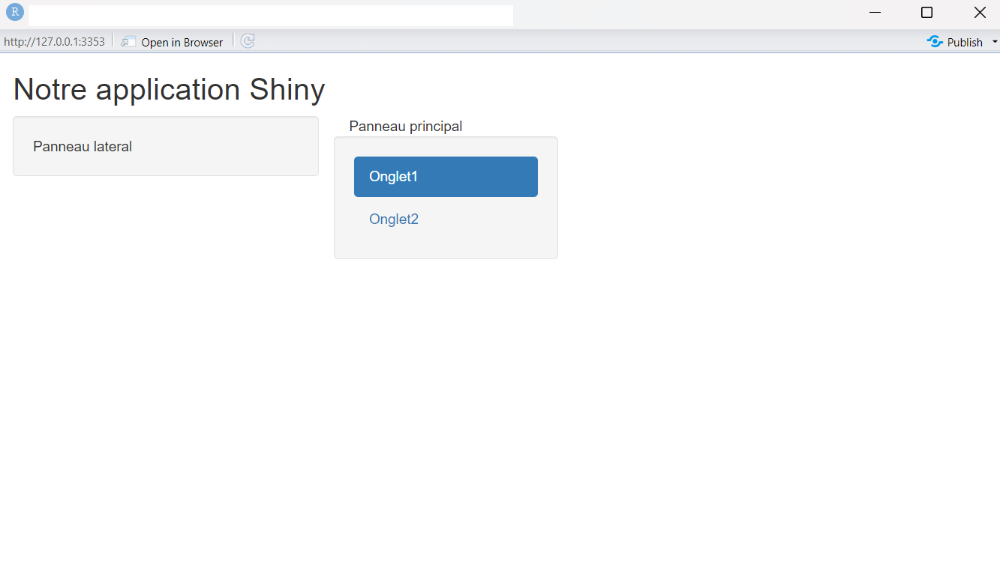

### Autres dispositions :

D'autres dispositions sont également possibles grâce à diverses autres
fonctions dont nous donnerons seulement quelques exemples: 

+ Nous pouvons créer une barre de navigation en haut de l’écran avec la fonctionc \textcolor{blue}{navbarPage()}  

+ Nous pouvons créer un menu complet en utilisant la fonction \textcolor{blue}{navbarMenu()} et regrouper le tabPanel() sous
différentes options de menu. 

+ Il y a également la création de colonnes avec \textcolor{blue}{column()...}

**Notons que :** Avec les packages **bslib** ou **shinydashboard** ,
nous pouvons créer des interfaces et des dispositions plus sophistiquées
avec des fonctions spécifiques à ces packages.

## Inputs-Outputs

### Inputs(widgets)

Les **inputs** donnent aux utilisateurs la possibilité d'interagir avec
l'application et sont placés dans le panneau latéral (sidebarPanel()).
Par exemple la fonction \textcolor{blue}{textInput} permet à l'utilisateur d'entrer un texte ; \textcolor{blue}{numericInput} permet d'entrer une valeur numerique. Toutes les fonctions d'entrées ont les deux premiers arguments suivants en commun:

-   **L'inputiD** qui doit être unique pour chacune d'elles;

-   **Le label** qui est la description du widget.

Dans l'exemple qui suit, nous avons utilisé `textInput()` pour demander à
l'utilisateur son nom et son prénom, `selectInput()` pour
sélectionner les variables qui doivent être affichées de la base de
données Iris et `sliderInput()` un curseur, pour régler le nombre de
barres de l'histogramme que l'on va definir.

```{r les_inputs}
library(shiny)
data(iris)
  ui <- fluidPage(
    titlePanel("Notre  application Shiny"),
    sidebarLayout(  
      sidebarPanel(  
        textInput(inputId = 'text',label = "Nom et prénom de l'utilisateur" ),
        sliderInput("curseur", "Nombre de bins:", 
                    min = 1, max = 50, value = 30),
       selectInput(inputId = 'var',label = 'choisir une variable',choices=names(iris))
  ),
    mainPanel()
    )
)

```


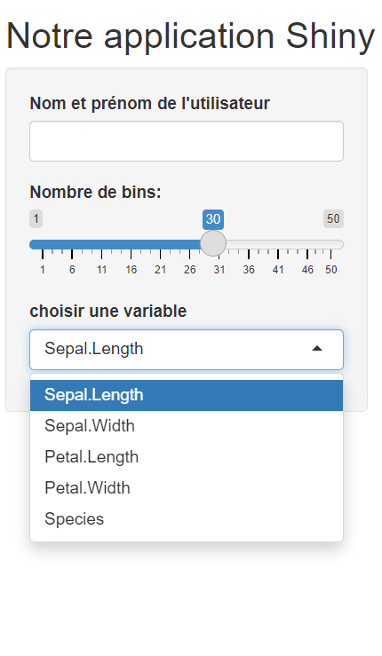

Il existe une varieté d'inputs pour des actions spécifiques...

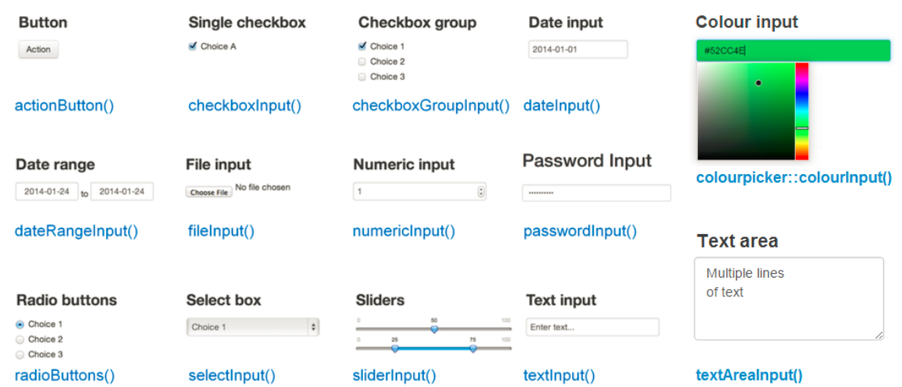

### Outputs

Les **Outputs** permettent de créer des espaces reservés pour les sorties que l'on veut visualiser dans la barre principale. Les sorties peuvent être n’importe quel objet créé par R et que nous voulons afficher dans notre application, tel qu’un graphique, un tableau...

Shiny fournit plusieurs fonctions outputs spécifiques au type de sortie. Dans notre exemple, nous affichons du texte via \textcolor{blue}{textOutput()}, une
table interactive via \textcolor{blue}{DToutput()}, un resumé statistique via \textcolor{blue}{verbatimTextOutput()} et un histogramme avec \textcolor{blue}{plotOutput()} en plaçant chaque sortie dans un onglet.

```{r les_outputs}
library(DT)
interface <- fluidPage(
  sidebarLayout(
  sidebarPanel(),
mainPanel (
 navlistPanel(
    tabPanel("Nom et Prénom",textOutput(outputId = "name")),
    tabPanel("Visualisation des données",DTOutput(outputId = "iris_data")),
    tabPanel("Statistiques",verbatimTextOutput(outputId = 'summary')),
    tabPanel("Histogramme",plotOutput(outputId = 'hist'))
  
      )
    )
  )
)

```

Voici comment s'affichent nos différents onglets correspondants aux
outputs cités plus haut:

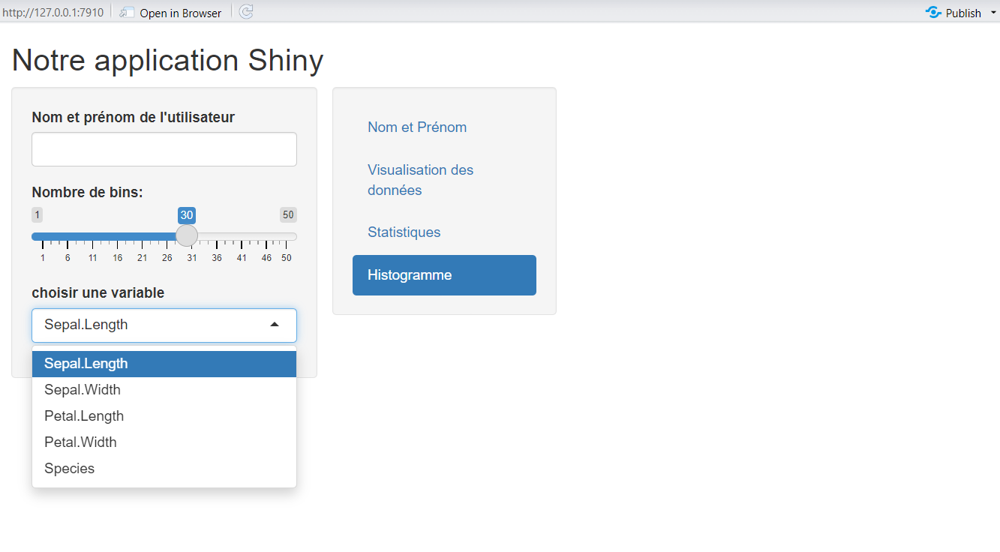

Voici quelques outputs et leurs fonctions:

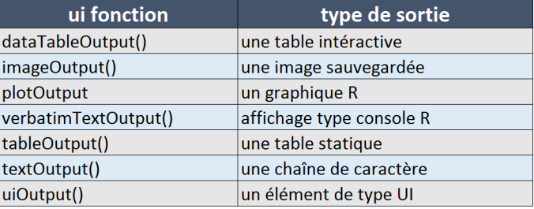

De la même manière que les fonctions d’input, toutes les fonctions d'
output ont un argument unique pour chacune d'elle qui est utilisé pour
identifier chaque sortie: c'est **l'outputiD.** L'outputiD permet de commander au serveur le type de sortie à génerer pour chaque output défini dans l'interface d'où l'importance de son unicité.

Jusque-là, aucune sortie n'est visible sur l'application: leur affichage
est commandé par le serveur...

## Le serveur

Le serveur est **"le cerveau"** de l'application shiny. Il reçoit les
interactions de l'utilisateur depuis l'interface utilisateur (les inputs
et outputs ) et génère des sorties dynamiques en fonction de ces
interactions. Les fonctions \textcolor{blue}{renderXXX() , reactive() , observe()} permettent de génerer ces sorties dynamiques. 

### Les fonctions renderXXX()

Au niveau du serveur, les différentes fonctions `render()` _(d'où la notation renderXXX())_  permettent de génerer une sortie en fonction des outputs placés dans l'interface utilisateur. Par exemple pour générer la sortie de graphique on utilise la fonction \textcolor{blue}{renderplot()} correspondant à la fonction plotOutput() utilisée dans le mainPanel(). 

Voici différentes fonctions `render()` et leurs fonctions : 

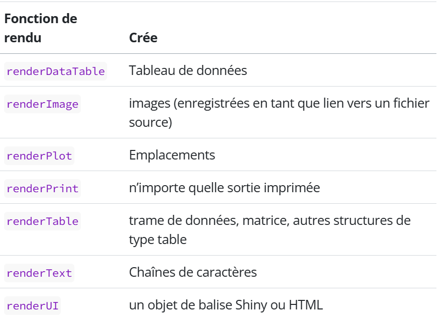

Dans l'exemple qui suit, en fonction des outputs définis plus haut, nous allons utiliser **rendertext()** pour afficher le nom et prénom de l'utilisateur, **renderDT()** pour afficher notre table de données interactive de la base Iris et **renderPlot()** pour afficher les histogrammes.

```{r  fonctions_du_rendu}
  
server <- function(input, output) {
  #texte
  output$name=renderText(paste0("Je m'appelle " ,input$text))
  output$iris_data=renderDT({iris})
  #resumé statistiques
  output$summary=renderPrint({
    summary(iris) })
  #Histogrammes
  output$hist=renderPlot({ hist(iris[[input$var]], 
breaks = seq(min(iris[[input$var]]), max(iris[[input$var]]), length.out = input$slider),
main = paste("Histogramme de", input$var),
xlab = input$var,
ylab = "Fréquence") })
}  
  
```

Sortie texte :

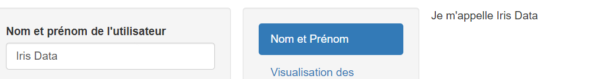

Sortie table :

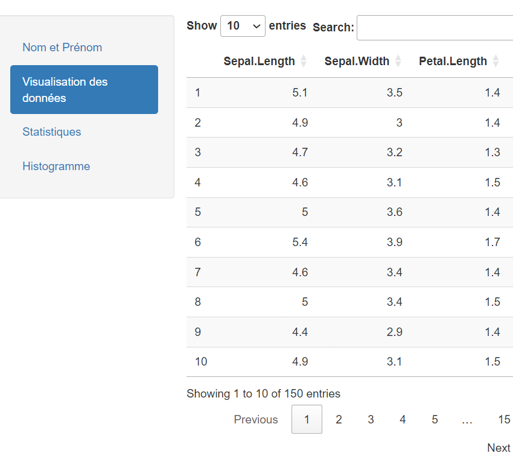

Sortie Statistique :

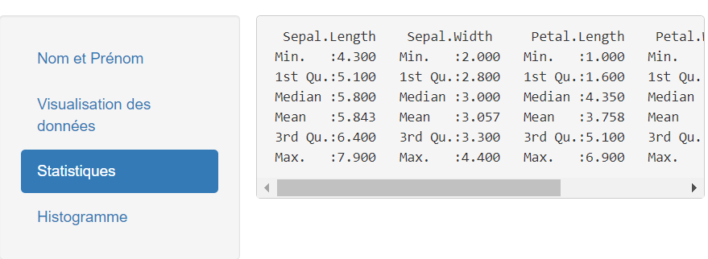

Sortie Histogramme :

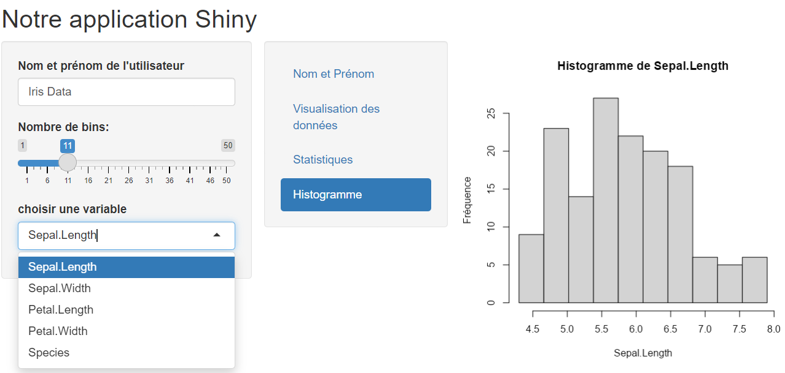


### Autres fonctions du server

Shiny utilise **la programmation réactive** : si une modification est
apportée à une variable, tout ce qui utilise cette variable est
réévalué. La réactivité permet de mettre à jour automatiquement une
sortie ( un graphique, un tableau, une carte Leaflet...) lorsqu’une
entrée est modifiée (un textInput, un selectInput, un jeu de données,
etc.).

Les entrées sont toujours des variables réactives, et elles ne peuvent
être utilisées que dans un contexte réactif.

Les fonctions renderXXX() sont des contextes réactifs, nous pouvons donc
utiliser \textcolor{blue}{input\$variable} dans n’importe quelle fonction renderXXX(). 
Cependant, la fonction server() ne l’est pas, et la variable d’entrée n’est pas accessible directement à l’intérieur de la fonction server(). Ainsi le code: 

```{r  code-erreur}
server <- function(input, output){
  print(input$name) 
} 
```

renvoie une erreur. 

Heureusement il existe d'autres contextes reactifs tels que les fonctions \textcolor{blue}{reactive(), observe(), eventReactive(), reactiveValues(), etc} 

## La fonction reactive({})

La réactivité est l'un des aspects fondamentaux de Shiny dans la conception des applications web. Dans le contexte de Shiny, la réactivité se réfère à la **capacité de mettre à jour dynamiquement l'interface utilisateur en réponse à des événements ou des changements effectués dans les données.**
Différentes fonctions sont utilisées au niveau du serveur pour créer ce contexte réactif ou le contrôler notamment les fonctions renderXXX() ou encore :  

1.	**reactive ()** et **reactiveValues()** : elles permettent de définir des variables réactives qui sont recalculées automatiquement chaque fois que les données sur lesquelles elles dépendent changent. Cela permet de maintenir des données à jour sans avoir à les recalculer manuellement à chaque changement.


```{r Réactivité}
library(DT)
server <- function(input, output, session) {    
    df=reactive({ 
    iris
    })#Création de la variable reactive
  
  output$iris_data=renderDT({
    df() #Utilisation de la variable dans une fonction render
  })
}
```

2.	**observeEvent ()**: permet de réagir de manière spécifique à des événements utilisateur, tels que le clic d'un bouton. 

3.	**observe ()** : cette fonction surveille les expressions réactives ou les valeurs réactives, mais ne génère pas de sortie directe vers l'interface utilisateur. Elle est principalement utilisée pour des tâches telles que la manipulation de données, l'enregistrement de données dans une base de données, l'envoi de notifications, etc. observe () permet d'effectuer des opérations réactives qui n'ont pas besoin de générer de sortie directement visible par l'utilisateur. 

4.	**isolate ()** : est utilisée pour empêcher la propagation des dépendances réactives dans certaines parties du code. Cela peut être utile pour éviter les recalculs inutiles.

\newpage

# Amélioration de l'apparence d'une application Shiny

L'amélioration de l'apparence d'une application Shiny passe non
seulement par une bonne structuration de l'application telle que,la
disposition des panneaux, onglets qui ont été mentionnés plus haut mais
aussi le changement de thèmes...

## La librairie Shinythemes

Le moyen le plus simple pour commencer est d’utiliser **shinythemes**.
C'est un package qui permet de changer le thème par défaut de
l'application shiny avec une large gamme de modèles prédéfinis.

Pour changer de thème, dans l’ui, ajouter le nouveau thème à l’aide de
la fonction **shinytheme()**.

Dans l'exemple qui suit, nous avons utilisé le thème *superhero*.

```{r changement_de_thème}
library(shinythemes)

ui <- fluidPage(theme = shinytheme("superhero"),
)
```


La liste de tous les thèmes disponibles se trouve sur le site
\textcolor{blue}{library(Bootswatch)}.

## Thème personnalisé

Pour créer un thème ou utiliser un thème qui ne fait pas partie de
shinythemes, il faudrait créer un sous-répertoire **“www”** dans le
répertoire d’application, placer le fichier **CSS**(Cascading Style
Sheets) du nouveau thème et ajouter la ligne suivante dans l'ui:

```{r thème_personnalisé}
ui <- fluidPage(theme = "theme.css",
                
)
```

**NB:** Mettre le fichier css dans un sous-répertoire appelé “www” de
votre application est très important! C’est la raison numéro 1 si cela
ne fonctionne pas.

Il y a beaucoup plus de possibilités pour l’amélioration de l’interface
et de l’expérience utilisateur avec Shiny et il existe également de
nombreux packages pouvant aider notamment
\textcolor{blue}{shinydashboard}.

\newpage

# Shinydashboard

Le package Shinydashboard est une extension du package Shiny qui permet
de **créer des tableaux de bord interactifs et esthétiques dans les applications web développées avec R Shiny**. Il offre un ensemble d'outils et de composantes pour concevoir des
interfaces utilisateur riches et complexes avec une mise en page de type
tableau de bord.

## Structure d'un dashboard

De la même manière qu'une application créée avec shiny, l'application
créée avec Shinydashboard comprend une partie interface utilisateur,
une partie serveur et une autre pour l'execution de l'application. La logique est la même que sur shiny: la partie UI définit la mise en page, les composants visuels et les interactions avec l’utilisateur et le serveur permet de génerer les sorties.

## Les principales dispositions

Dans la partie **interface utilisateur** , la mise en page est assurée
par la fonction `dashboardPage()` qui prend en argument :

-   la fonction `dashboardHeader()` permettant de créer l’en-tête de
    l'application;

-   la fonction `dashboardSidebar()` pour la création du panneau latéral;

-   la fonction `dashboardBody()` pour la création de la partie
    principale. 
    
D'autres arguments sont également possibles mais optionnels :
`title`(titre dans le navigateur), `skin`(l'habillage ou couleur
principale de l'application qui par défaut est bleue).

```{r shinydashboard}
ui <- dashboardPage(
  dashboardHeader(title="L'en-tete"),
  dashboardSidebar(title="Le panneau latéral "),
  dashboardBody("Le panneau principal "),
  skin="purple"
)
server <- function(input, output) {
}
shinyApp(ui, server)
```

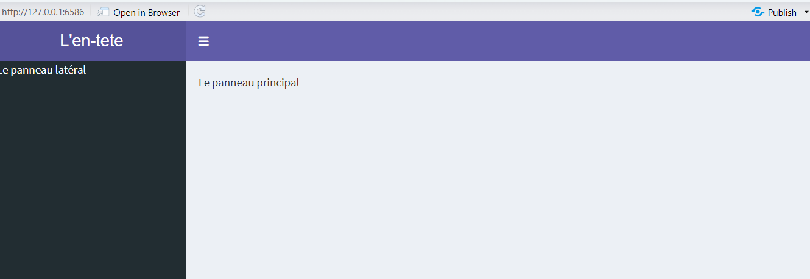

## Disposition supplémentaires :

### En-tête :

Mis à part le titre , nous pouvons placer 3 types de menus déroulants
dans l'en-tete (**messages, notifications et tâches**).

Cela peut se faire avec la fonction `dropdownMenuOutput()`dans l'UI qui
permet de créer un conteneur pour chaque type de menu et ensuite, dans
le serveur, nous utilisons renderMenu pour afficher dynamiquement les
contenus dans les menus.

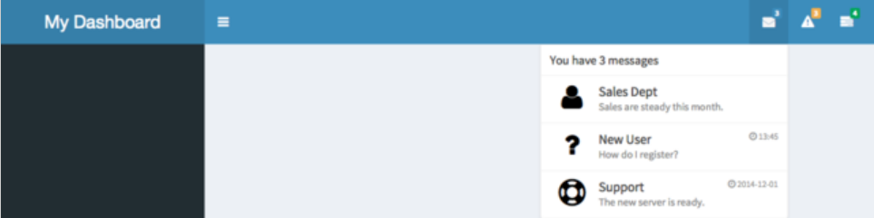

### Barre latérale :

La partie latérale contient les elements qui sont généralement utilisés
pour interagir avec la partie principale, ou encore naviguer entre
différentes pages ou sections de l'application. Il s'agit des inputs
habituels (sliderInput,selectInput...) mais aussi des éléments de menu
qui se présentent sous forme d'onglets créés par la fonction
`menuItem()`;

La déclaration des `menuItem` dans le **dashboardSidebar** est suivie
d'une déclaration de `tabItem` au niveau du **dashboardBody**
\textcolor{blue}{permettant de faire apparaitre le contenu correpondant à l'onglet activé}. 

La liaison entre les deux se fait par l'argument **tabName** qui est
unique.

```{r remplisassage_barre_latérale}
dashboardSidebar(
  sidebarMenu(
    menuItem("Dashboard", tabName = "dashboard", icon = icon("dashboard")),
    menuItem("Onglets", icon = icon("th"), tabName = "widgets",
             badgeLabel = "new", badgeColor = "green")
  )
)
dashboardBody(
  tabItems(
    tabItem(tabName = "dashboard",
      h2("Contenu du Dashboard")
    ),

    tabItem(tabName = "widgets",
      h2("Contenu des onglets")
    )
  )
)
```

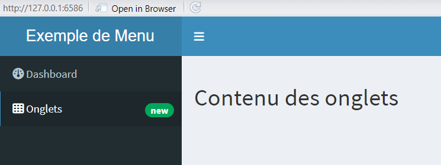

### Corps ou partie principale :

Mis à part les `tabItem`,la partie principale peut contenir n'importe
quel contenu standard de shiny mais, il est en plus possible de déclarer
des box pouvant inclure différents types de contenus, ce qui est plus
esthétique pour les tableaux de bord.

Cela se fait avec la fonction `box()`dans laquelle on peut integrer des
éléments de type input ou output.

Il en existe trois autres types : `infoBox()`,`valueBox`,`tabBox()`.

La disposition des boites se fait avec `fluidrow()`ou `column()`.

L'exemple suivant montre la création de differents types de box avec
affichages d'icônes issues de la bibliothèque **Font Awesome**, et
intégration des onglets pour le type tabBox.

```{r corps_du_dashboard}
  dashboardBody(
    fluidRow(
      box(title = "Box par Défaut", "Ceci est un exemple de box "),
     infoBox("info_box", "Information", "Ceci est un exemple d'infoBox avec une icône.", 
              icon = icon("info-circle")),
      tabBox(
        title = "TabBox",
        tabPanel("onglet 1", "Contenu 1", icon = icon("chart-bar")),
        tabPanel("onglet 2", "Contenu 2", icon = icon("chart-pie")),
        tabPanel("onglet 3", "Contenu 3", icon = icon("chart-line"))
      ),
      valueBox(150, "Nombre total(exemple de valueBox)", 
               icon = icon("database", lib = "font-awesome"))
    )
  )
```

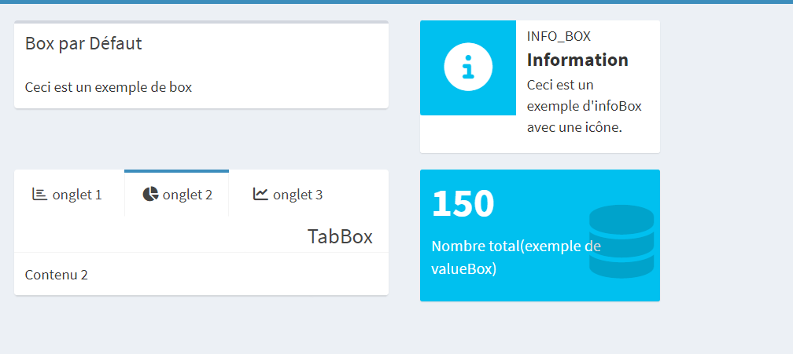

### Le server

Dans une application ShinyDashboard, le "server" conserve toutes les
fonctions habituelles de Shiny: _render()_, _Output()_, _reactive()_,
_observe()_, _etc_. Ces fonctions sont essentielles pour définir le
comportement interactif de l'application, traiter les données, générer
des sorties et maintenir la réactivité de l'interface utilisateur.

Dans la partie "UI" de l'application, on utilise les fonctions tabItem()
ou box() pour définir les éléments de contenu dans les onglets ou les
boîtes du tableau de bord et on y spécifie les sorties que l'on souhaite
afficher, telles que des graphiques, des tableaux, des valeurs, etc., en
utilisant des fonctions de sortie comme **plotOutput(), tableOutput(),
verbatimTextOutput()**, etc.

Dans le "server", les fonctions de rendu comme renderPlot(),
renderTable(), renderText(), etc., permettent de générer les sorties
spécifiées dans le "UI".

Pour ce qui est de la réactivité, Chaque fois qu'il y a un changement dans les entrées des réactifs utilisés pour le rendu des sorties, le "server" est
automatiquement déclenché pour recalculer et mettre à jour les sorties
correspondantes (notamment avec l'utilisation de \textcolor{blue}{observe()} ou \textcolor{blue}{reactive()}).  Cela garantit que l'interface utilisateur reste réactive et que les contenus des tabItem ou box soient régulièrement mis à jour en fonction des actions de l'utilisateur ou des changements dans les données.

## Exemple d'une application simple avec shinydashboard utilisant les éléments vus précédemment

```{r exemple_complet}
data <- data.frame(
  x = 1:100,
  y = rnorm(100)
)
ui <- dashboardPage(
  dashboardHeader(title = "Exemple de tableau de bord",
                  titleWidth = 450),
  dashboardSidebar(
    sidebarMenu(
      menuItem("Onglet 1", tabName = "tab1"),
      menuItem("Onglet 2", tabName = "tab2")
    )
  ),
  dashboardBody(
    tabItems(
      tabItem(tabName = "tab1",
              tabBox(title = "Tab Box 1",
                     tabPanel("Graphique",
                              plotOutput("plot1")),
                     tabPanel("Tableau",
                              tableOutput("table1"))
              ),
              infoBox("Info Box ", "Il s'agit de données aléatoires ", icon = icon("info")),
              valueBox(mean(data$x),"Moyenne de la variable x" , icon = icon("star"))
      ),
      tabItem(tabName = "tab2",
              tabBox(title = "Tab Box 2",
                     tabPanel("Graphique",
                              plotOutput("plot2"))
              ),
      )
    )
  )
)
server <- function(input, output) {
  output$plot1 <- renderPlot({
    plot(data$x, data$y, main = "Graphique 1", type = "l")
  })
  output$table1 <- renderTable({
    head(data)
  })
  output$plot2 <- renderPlot({
    plot(data$y, data$x, main = "Graphique 2", pch = 19)
  })
}
shinyApp(ui, server)

```

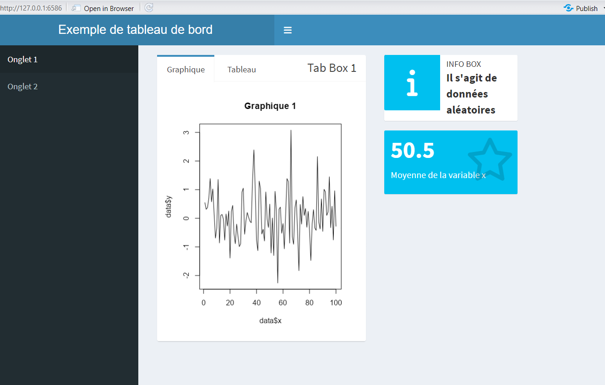

\newpage

# Publier une aplication Shiny

En lançant la commande runApp, R démarre un petit serveur Shiny sur
notre ordinateur afin que nous puissions tester notre application. Mais
ce n’est pas la bonne façon si nous souhaitons rendre notre application
publique, accessible à tout le monde sur internet.

## Hébergement sur shinyapp

Il existe plusieurs façons de publier son application Shiny. Une façon
simple pour y parvenir est d’utiliser le service
\textcolor{blue}{http://shinyapps.io.} Ce service permet d’héberger
gratuitement jusqu’à 5 applications par utilisateur. Ceci étant, pour héberger une application sur le site *shinyapps.io*, il faut suivre les étapes ci-après:

1.  S'inscrire sur le site et s'y connecter;

2.  Dans le site, un tableau de bord récapitulatif de vos applications
    s'affiche. Il vous est premièrement demandé d'installer sur R le
    package \textcolor{blue}{rsconnect} ;

```{r  installation_rsconnect, message=FALSE}
install.packages("rsconnect")
```

3.  Ensuite, copier les lignes présentées dans la pop-up du type (ceci
    est un exemple avec le compte *joe-R-Shiny-2022*) :

```{r creation_du_compte}
rsconnect::setAccountInfo(name='joe-r-shiny-2022',
                          token='6280C86118286E5417298841A85EE625',
                          secret='ymUisnP7jRsyShTvGW0iAiUwnOGv98HnyMbcMd19')
```

4.  Exécuter ces lignes sous R : vous êtes alors connecté à votre compte
    shinyapps.io depuis R.

5.  Il suffit maintenant d'exécuter la ligne de code suivante (mise en
    commentaire).

```{r déploiement }
#rsconnect::deployApp("chemin_vers_le_dossier_de_votre_application")
```

Votre application est maintenant en ligne.

Dans ce dossier, vous devez soit placer votre fichier "app.r" soit vos
deux fichiers "ui.r" et "server.r".

**NB:**

-   Pour lancer la mise en ligne, ayant déjà un compte sur shinyapp,
    vous pouvez cliquer sur \textcolor{blue}{Publish application } ,
    situé juste à la droite de Run App.

-   RStudio vous demandera alors d’aller chercher votre “token” prouvant
    votre identité sur le site de shinyapps.io. Vous copiez-coller cette
    valeur et vous êtes prêt à rendre votre application publique.
    L’opération peut prendre quelques minutes parce que shinyapps.io
    doit, entre autres, installer sur le serveur la liste de tous les
    packages que vous avez utilisés dans votre application.

-   Une fois l’opération complétée, votre application s’ouvrira
    automatiquement dans votre navigateur web.

-   Si vous perdez l’adresse de votre application, vous avez accès à la
    liste de toutes vos applications dans votre compte sur shinyapps.io

## Mise à jour d'une application Shiny

Pour mettre votre application à jour, vous n’avez qu’à refaire la
publication avec *Publish Application…*. L’ancienne version sera effacée
et remplacée par la nouvelle.

\newpage

\textcolor{blue}{\section*{CONCLUSION}\addcontentsline{toc}{section}{CONCLUSION}}

R Shiny émerge comme un outil polyvalent et puissant pour le
développement d'applications web interactives avec R. Sa facilité
d'installation et d'utilisation en fait un choix attrayant pour les
analystes de données et les développeurs cherchant à partager leurs
résultats de manière dynamique.

De la création d'interfaces utilisateur conviviales à la publication en
ligne de ces applications, Shiny offre une solution complète pour
répondre aux besoins croissants de visualisation et de communication des
données. De plus, avec une communauté active et un ensemble croissant de
ressources et de packages disponibles, les possibilités d'amélioration
et d'extension des fonctionnalités d'applications Shiny sont
pratiquement illimitées. C'est ainsi que **Shinydashboard** offre un
ensemble d'outils et de composants pour concevoir des interfaces
utilisateur riches et complexes avec une mise en page de type tableau de
bord.

Ce rapport constitue une ressource précieuse pour quiconque souhaite
maîtriser R Shiny et créer des applications web interactives et
esthétiquement plaisantes pour répondre à divers besoins tels que
l'analyse de données, la visualisation de données, la recherche
scientifique et bien d'autres encore.

En somme, investir dans l'apprentissage et la maîtrise de R Shiny promet
d'être un atout précieux pour tout professionnel cherchant à tirer le
meilleur parti de ses analyses de données et à les partager de manière
efficace et engageante. 

\newpage

\textcolor{blue}{\section*{BIBLIOGRAPHIE et WEBOGRAPHIE}\addcontentsline{toc}{section}{BIBLIOGRAPHIE et WEBOGRAPHIE}} 

- Aboubacar HEMA, CoursRAvance , _chap_4_avance_, pp.41-44 

- Alison JOLLOIS, _Dashboard avec shiny_ (alisonjollois.github.io) 

- Aurélien DAVAL, _R: Introduction Au Package Shiny_ (aureliendaval.github.io) 

- Christophe Nicault, _Construisez votre première application avec Shiny_ 

- Christophe Nicault, _Améliorez l’apparence de votre application Shiny_

- Dashboards with Shiny, _The Epidemiologist R Handbook_ (epirhandbook.com)

- _Getting started with Shiny Dashboard_ (rstudio.github.io) 

- Hadley Wickham, _Mastering shiny : Welcome | Mastering Shiny_ (mastering-shiny.org) 

- Josue Afouda, _Iris_Shiny_web_app_ (github.com)

- _Shiny Dashboard_ (rstudio.github.io) 

- _Tutoriel : visualisation avec R_ (lrouviere.github.io)


